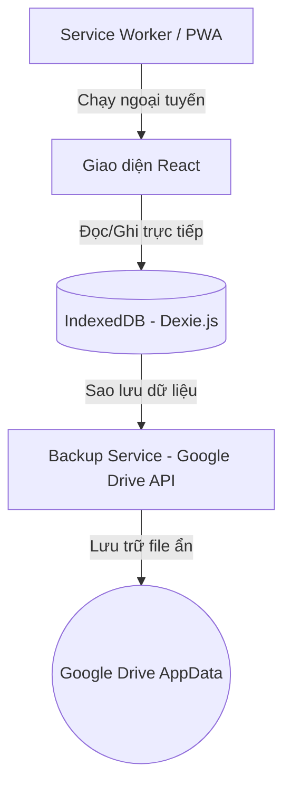

# Kiến trúc hệ thống Xăng Xe (Architecture)

Ứng dụng **Xăng Xe** được xây dựng theo kiến trúc **Offline-First**, tối ưu hóa trải nghiệm sử dụng trên thiết bị di động ngay cả khi không có kết nối Internet.

---

## 1. Mô hình Offline-First
Ứng dụng hoạt động độc lập và lưu trữ toàn bộ dữ liệu trực tiếp trên thiết bị của người dùng. Kết nối mạng chỉ cần thiết khi người dùng thực hiện sao lưu/khôi phục dữ liệu lên đám mây (Google Drive).

---

## 2. Các thành phần chính

### A. Cơ sở dữ liệu cục bộ (IndexedDB - Dexie.js)
Nằm tại [src/db/db.js](file:///d:/AI-Fuel-Tracker/src/db/db.js), Dexie.js được sử dụng để bọc ngoài IndexedDB giúp việc truy vấn dữ liệu dễ dàng và an toàn hơn.
* **Bảng `vehicles`**: Quản lý thông tin phương tiện bao gồm:
  * `name` (Tên xe).
  * `type` (Phân loại: `Motorcycle` hoặc `Car`).
  * `plateNumber` (Biển số xe).
  * `tankCapacity` (Dung tích bình xăng - Lít, dùng để tối ưu thuật toán cảnh báo nhập liệu).
* **Bảng `refuelings`**: Quản lý lịch sử đổ xăng (ODO, số lít, đơn giá, tổng tiền, loại xăng `fuelType`, trạng thái đầy bình `fullTank`, trạng thái cảnh báo dữ liệu `hasWarning` và lý do `warningReason`).
* **Bảng `expenses`**: Quản lý các chi phí phát sinh khác (Bảo dưỡng, rửa xe, sửa chữa, ảnh hóa đơn...).

### B. Cơ chế đồng bộ đa phương tiện & Bộ lọc dữ liệu theo Xe
* **Trạng thái xe hiện hành (Active Vehicle)**: Ứng dụng ghi nhớ ID xe đang chọn và lưu trong `localStorage`. Header của ứng dụng sẽ tự động hiển thị biểu tượng động (Icon **`Bike`** cho xe máy và **`Car`** cho ô tô) và tên của chiếc xe đó.
* **Bộ lọc thông tin**: Toàn bộ dữ liệu thống kê trên Dashboard (Tổng chi phí, Hiệu suất km/L, Tổng nhiên liệu đã tiêu thụ, Biểu đồ lịch sử) và Lịch sử ghi chép ở các form chỉ hiển thị các bản ghi thuộc về xe hiện hành đang chọn.
* **Dọn dẹp dữ liệu mẫu tự động**: Khi người dùng thêm chiếc xe cá nhân thật đầu tiên của mình, hệ thống sẽ tự động phát hiện và xóa xe mẫu mặc định ("Honda Vision - 29A-123.45") cùng các bản ghi mẫu liên kết để cung cấp không gian dữ liệu sạch hoàn toàn.

### C. Cơ chế tính toán hiệu suất nhiên liệu (km/L)
* Hiệu suất tiêu hao nhiên liệu được tính theo phương pháp **Cộng dồn đến kỳ đầy bình tiếp theo**:
  * Nếu người dùng không tích chọn "Đổ đầy bình" ở một số lần đổ xăng lẻ, lượng xăng (lít) của các lần đó sẽ được **cộng dồn**.
  * Đến lần tiếp theo người dùng tích chọn "Đổ đầy bình", ứng dụng sẽ tính quãng đường đi được từ lần đầy bình trước đó chia cho tổng lượng xăng đã đổ trong toàn bộ các kỳ đó để cho ra con số hiệu suất trung bình chính xác nhất.

### D. Service Worker & PWA
Được tích hợp qua `@vitejs/plugin-pwa` cấu hình trong [vite.config.js](file:///d:/AI-Fuel-Tracker/vite.config.js).
* Tự động cache các tài nguyên tĩnh (HTML, CSS, JS, Icon) khi cài đặt ứng dụng.
* Tự động kiểm tra trạng thái **Standalone** để ẩn banner gợi ý cài đặt nếu người dùng đã thêm app ra màn hình chính.
* Cơ chế **Snooze 7 ngày**: Khi người dùng nhấn tắt banner gợi ý cài đặt, app sẽ ẩn gợi ý này trong vòng 7 ngày để tránh làm phiền.
