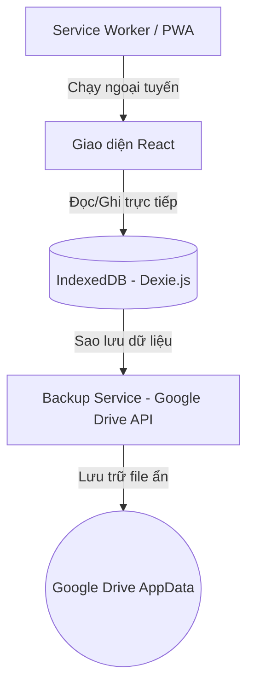

# Kiến trúc hệ thống Xăng Xe (Architecture)

Ứng dụng **Xăng Xe** được xây dựng theo kiến trúc **Offline-First**, tối ưu hóa trải nghiệm sử dụng trên thiết bị di động ngay cả khi không có kết nối Internet.

---

## 1. Mô hình Offline-First
Ứng dụng hoạt động độc lập và lưu trữ toàn bộ dữ liệu trực tiếp trên thiết bị của người dùng. Kết nối mạng chỉ cần thiết khi người dùng thực hiện sao lưu/khôi phục dữ liệu lên đám mây (Google Drive).

---

## 2. Các thành phần chính

### A. Cơ sở dữ liệu cục bộ (IndexedDB - Dexie.js)
Nằm tại [src/db/db.js](file:///d:/AI-Fuel-Tracker/src/db/db.js), Dexie.js được sử dụng để bọc ngoài IndexedDB giúp việc truy vấn dữ liệu dễ dàng và an toàn hơn.
* **Bảng `vehicles`**: Quản lý thông tin phương tiện (Tên xe, biển số, loại xe).
* **Bảng `refuelings`**: Quản lý lịch sử đổ xăng (ODO, số lít, đơn giá, tổng tiền, loại xăng, trạng thái đầy bình).
* **Bảng `expenses`**: Quản lý các chi phí phát sinh khác (Bảo dưỡng, rửa xe, sửa chữa, ảnh hóa đơn...).

### B. Service Worker & PWA
Được tích hợp qua `@vitejs/plugin-pwa` cấu hình trong [vite.config.js](file:///d:/AI-Fuel-Tracker/vite.config.js).
* Tự động cache các tài nguyên tĩnh (HTML, CSS, JS, Icon) khi cài đặt ứng dụng.
* Cho phép người dùng "Thêm vào màn hình chính" (Add to Home Screen) trên thiết bị iOS/Android để sử dụng như một ứng dụng gốc (Native App).
* Tự động cập nhật ứng dụng ngầm khi có phiên bản mới (autoUpdate).

### C. Cơ chế tính toán hiệu suất nhiên liệu (km/L)
* Hiệu suất tiêu hao nhiên liệu được tính theo phương pháp **Cộng dồn đến kỳ đầy bình tiếp theo**:
  * Nếu người dùng không tích chọn "Đổ đầy bình" ở một số lần đổ xăng, lượng xăng (lít) của các lần đó sẽ được **cộng dồn**.
  * Đến lần tiếp theo người dùng tích chọn "Đổ đầy bình", ứng dụng sẽ tính quãng đường đi được từ lần đầy bình trước đó chia cho tổng lượng xăng đã đổ trong toàn bộ các kỳ đó để cho ra con số hiệu suất trung bình chính xác nhất.
